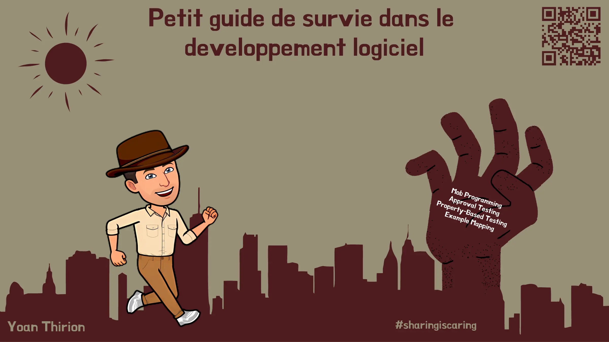
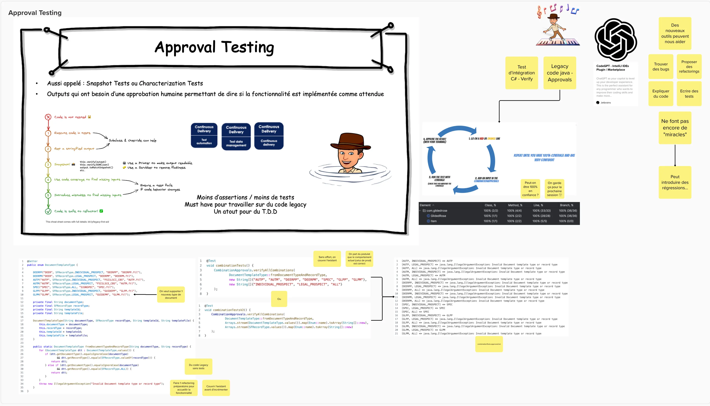
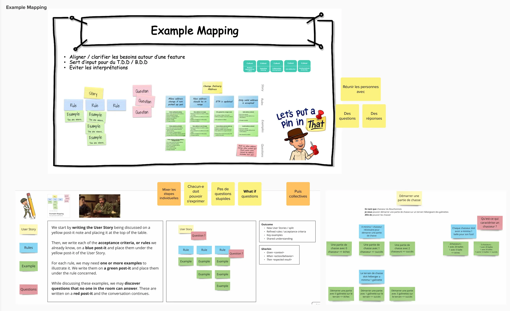
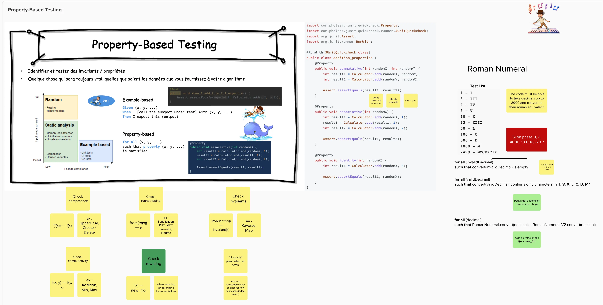
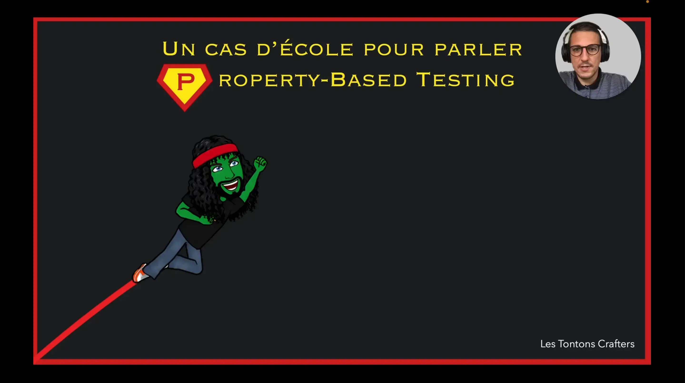

# Petit guide de survie dans le développement logiciel (partie 1)

## Plan
Durant cette session mélangeant interactions, théorie et live coding je vous propose de découvrir certaines pratiques techniques peu connues ou méconnues mais qui peuvent sauver des vies.

Par "sauver des vies", j’entends permettre aux développeur·euses d’être encore plus efficaces et confiants au quotidien.

Ainsi nous creuserons ensemble :

- [Le Mob Programming](#mob-programming)
- [L’Approval Testing](#approval-testing)
- [L’Example Mapping](#example-mapping)
- [Le Property-Based Testing](#property-based-testing)

Vous repartirez avec le plein d’envie d’expérimentation et d’idées.

## Mob Programming

## Approval Testing

## Example Mapping

## Property-Based Testing

### Vidéo - un cas d'école pour le Property-Based Testing

## "Solution"
Pour chaque pratique technique, ce repository contient 1 exemple de code ainsi qu'une proposition de solution utilisant la technique spécifiée dans le répertoire `solution`.

## Board Mural
[Export board mural](files/mural-partie1.pdf)